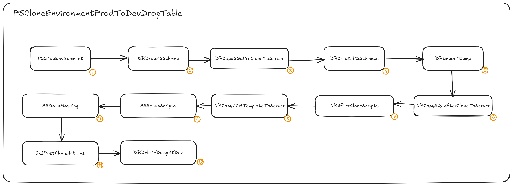

# Peoplesoft refresh automation using Rundeck

## Introduction

Peoplesoft is an application suite owned by Oracle Corporation that contains modules for backoffice administration (FSCM - Financials and Supply Chain Management and HCM - Human Capital Management) and school administration (CS - Campus Solutions). The application architecture is n-tier, called PIA - Peoplesoft Internet Architecture, or also Pure Internet Architecture.

A major Brazilian university used the HCM and FSCM modules of the Oracle Peoplesoft application in its operations between 2010 and 2023. Three non-production HCM environments and three non-production FSCM environments were used to apply corrective patches and updates, as detailed below:

<picture>
 <source media="(prefers-color-scheme: dark)" srcset="images/intro01.png">
 <source media="(prefers-color-scheme: light)" srcset="images/intro01.png">
 
</picture>

- **DEV -** Development environment, refreshed on demand.
- **UAT -** User acceptance testing environment, refreshed on demand.
- **PREPROD -** Pre-production environment, refreshed on daily bases. Used for error checking.
- **PROD -** Production environment.

To support development activities, the production environment needs to be replicated to the non-production environments, a process called refresh. The frequency at which refresh is performed depends on the purpose of the target environment. 

For example, the PREPROD environment is used to identify errors that have recently occurred in production. Therefore, the data in this environment must be recent but must not expose personal data (PII). Therefore, the refresh process includes a data masking activity.

## What does a Peoplesoft refresh consist of?

The refresh of each environment consists of some activities, taking about 4 hours to complete:

<picture>
 <source media="(prefers-color-scheme: dark)" srcset="images/intro02.png">
 <source media="(prefers-color-scheme: light)" srcset="images/intro02.png">
 
</picture>

1. Stop all components: web server, application and process scheduler 
2. Delete all SYSADM schema objects: tables, procedures, triggers, types etc.
3. Logical backup (EXPDP) of production database
4. Logical restore (IMPDP) of production database
5. Setup of web, application and process scheduler files
6. Anonymization of PII data
7. Start all components

Steps 2, 3 and 4 could be replaced by drop database followed by a clone database, but in daily operation the activities of drop SYSADM schema followed by a IMPDP proved more stable.

The Peoplesoft refresh process was automated in 2019 and over the next 4 years more than 2,500 automated refreshes were performed. In the next topics I will detail how these activities were automated through the Rundeck application. 

## What is Rundeck

[Rundeck](https://www.rundeck.com) is a open source application to automate manual procedures, available in two versions: community and commercial. The tasks to be executed are structured in [jobs](https://docs.rundeck.com/docs/learning/getting-started/jobs/), within a project. A job can execute actions on the local Rundeck [node](https://docs.rundeck.com/docs/learning/getting-started/nodes-overview.html) or on remote [nodes](https://docs.rundeck.com/docs/learning/getting-started/nodes-overview.html), using one of the dozens of available [plugins](https://docs.rundeck.com/docs/manual/plugins/full-list.html).

The idea of ​​using Rundeck to refresh Peoplesoft came from the website **[psadmin.io](https://www.psadmin.io)** but, except for the idea, everything else had to be learned from scratch. Let's get into the details.

> [!NOTE] 
> If you've never used Rundeck before, I highly recommend that you read the application documentation before you get started. This will clarify what Rundeck is, how to install it, and how to configure it. You can access the Rundeck manual [here](https://docs.rundeck.com/docs/learning).

# Peoplesoft refresh process

The refresh process of non-productive Peoplesoft environments can be represented in this graph:

<picture>
 <source media="(prefers-color-scheme: dark)" srcset="images/rundeck01.png">
 <source media="(prefers-color-scheme: light)" srcset="images/rundeck01.png">
 
</picture>

Below I will describe each process, going into detail when necessary. The scripts, jobs and templates are available in the [`scripts`](scripts/) folder.

## Rundeck configurations

## passwords

## external files

## Options

In order to set the correct context in which the commands will be executed, some job options need to be set in the job context.

> [!NOTE] 
> If you are new to Rundeck, I recommend that you consult the documentation to learn what Job Options are. To do so, use [this link](https://docs.rundeck.com/5.8.0/manual/jobs/job-options.html).

All context settings are made by job options defined in the PSCloneEnvironmentProdToDevDropTable job. The values ​​selected by the user in the PSCloneEnvironmentProdToDevDropTable job are inherited by other jobs.

## PSCloneEnvironmentProdToDevDropTable

This is the master job, which orchestrates all other jobs. The options defined in this job are inherited by all orchestrated jobs.

For convenience, the job option values ​​available to users are defined in JSON files stored in the Rundeck file system. This way, when the JSON file receives a new value, that value will automatically appear for the user the next time the job is opened.

> [!NOTE] 
> You can learn more about JSON format job options [here](https://docs.rundeck.com/5.8.0/manual/jobs/job-options.html#json-format).

> [!TIP] 
> All JSON files used in job options are available in the [`scripts/jobs`](scripts/json_files/) directory. These files must be copied to the path indicated in the definition of each job option. If the directory indicated in the path does not exist, create it.


## 1) PSStopEnvironment

This job is responsible for stop all Peoplesoft components, in the following order: APP server, PRCS server and WEB server. In order to define which APP server is going to be stopped, some Rundeck options need to be defined before. 


```bash
#!/bin/bash
echo "[@job.project@ - @job.name@ - SCRIPT START]"

echo "EnvironmentFrom: "	@option.EnvironmentFrom@
echo "EnvironmentTo: "      @option.EnvironmentTo@
echo "prodHttpAddress: "    @option.prodHttpAddress@
echo "DBAppServer: "        @option.DBAppServer@
echo "DBClientVersion: "    @option.DBClientVersion@
echo "devHttpAddress: "     @option.devHttpAddress@
echo "devHttpPort: "        @option.devHttpPort@
echo "devJSLPort: "         @option.devJSLPort@
echo "siteName: "           @option.siteName@
echo "tuxedoPath: "      @option.tuxedoPath@

# setting ORACLE DATABASE environment variables
export TMP=/tmp
export TMPDIR=$TMP
export ORACLE_BASE=/APP/oracle
export ORACLE_HOME=$ORACLE_BASE/product/@option.DBClientVersion@/client_1
export PATH=$PATH:$HOME/.local/bin:$HOME/bin
export PATH=$ORACLE_HOME/bin:$PATH
export ORACLE_SID=@option.EnvironmentTo@

# setting PEOPLESOFT environment variables
export SITENAME="$(echo $ORACLE_SID | tr '[A-Z]' '[a-z]')"
. /APP/psft/$SITENAME/psconfig.sh

# get the server name
export SERVERNAME=@option.DBAppServer@
export SERVERNAME="$(echo $SERVERNAME | tr '[A-Z]' '[a-z]')"
echo $SERVERNAME

export PATH=$PATH:$PS_HOME/appserv
export DOMAIN=$ORACLE_SID
export PIA_DOMAIN=pia-$SITENAME
export TUXCONFIG=/APP/psft/$SITENAME/appserv/$ORACLE_SID
export TUXDIR=@option.tuxedoPath@
export LD_LIBRARY_PATH=$LD_LIBRARY_PATH:$TUXDIR/lib
export PATH=$PATH:$TUXDIR/bin


# E-COB: COBOL Compile Error "cob: command not found" when Running "pscbl.mak" (Doc ID 1383914.1)
# E-COB: ld.so.1: PSRUN: fatal: libcobrts64.so.2: open failed: No such file or directory (Doc ID 660015.1)
export COBDIR=/APP/cobol/sx51_wp15
export PATH=$COBDIR/bin:$PATH
export COBPATH=/APP/psft/$SITENAME/cblbin
export LD_LIBRARY_PATH=$LD_LIBRARY_PATH:$COBDIR/lib

export SOURCE_SITENAME="$(echo @option.EnvironmentFrom@ | tr '[A-Z]' '[a-z]')"

#env

pwd
cd $PS_HOME
pwd

echo "########################################"
echo "Stopping APP, PRCS e WEB"

echo " Stopping APP Server ...."
psadmin -c shutdown -d $DOMAIN

var="psadmin -c cleanipc -d $DOMAIN"
echo $var
eval $var

echo " Cleaning cache ...."
rm -rf $PS_HOME/appserv/$DOMAIN/CACHE/*

echo " Stopping PRCS Server ...."
psadmin -p stop -d $DOMAIN

echo " Stopping WEB server...."
cd $PS_HOME/webserv/$PIA_DOMAIN/bin
./stopPIA.sh

echo " Cleaning WEB server cache...."
rm -rf $PS_HOME/webserv/$PIA_DOMAIN/applications/peoplesoft/PORTAL.war/$SITENAME/cache/*

wait $!

echo "[@job.project@ - @job.name@ - SCRIPT END]"
```

## 2) DBDropPSSchema

# Final remarks
