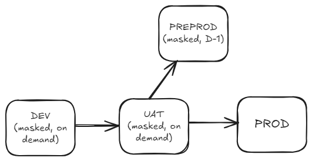
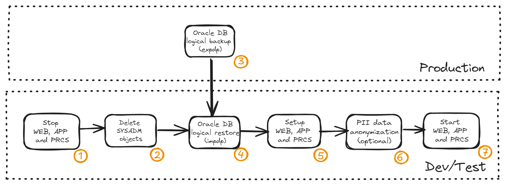

# Peoplesoft refresh automation using Rundeck

## Introduction

Peoplesoft is an application suite owned by Oracle Corporation that contains modules for backoffice administration (FSCM - Financials and Supply Chain Management and HCM - Human Capital Management) and school administration (CS - Campus Solutions). The application architecture is n-tier, called PIA - Peoplesoft Internet Architecture, or also Pure Internet Architecture.

A major Brazilian university used the HCM and FSCM modules of the Oracle Peoplesoft application in its operations between 2010 and 2023. Three non-production HCM environments and three non-production FSCM environments were used to apply corrective patches and updates, as detailed below:

<picture>
 <source media="(prefers-color-scheme: dark)" srcset="images/intro01.png">
 <source media="(prefers-color-scheme: light)" srcset="images/intro01.png">
 
</picture>

- **DEV -** Development environment, refreshed on demand.
- **UAT -** User acceptance testing environment, refreshed on demand.
- **PREPROD -** Pre-production environment, refreshed on daily bases. Used for error checking.
- **PROD -** Production environment.

The refresh of each environment consists of some activities, taking about 4 hours to complete:

<picture>
 <source media="(prefers-color-scheme: dark)" srcset="images/intro02.png">
 <source media="(prefers-color-scheme: light)" srcset="images/intro02.png">
 
</picture>

1. Stop all components: web server, application and process scheduler 
2. Delete all SYSADM schema objects: tables, procedures, triggers, types etc.
3. Logical backup (EXPDP) of production database
4. Logical restore (IMPDP) of production database
5. Setup of web, application and process scheduler files
6. Anonymization of PII data
7. Start all components

Steps 2, 3 and 4 could be replaced by drop database followed by a clone database, but in daily operation the activities of drop SYSADM schema followed by a IMPDP proved more stable.

## What is Rundeck

## Final remarks
